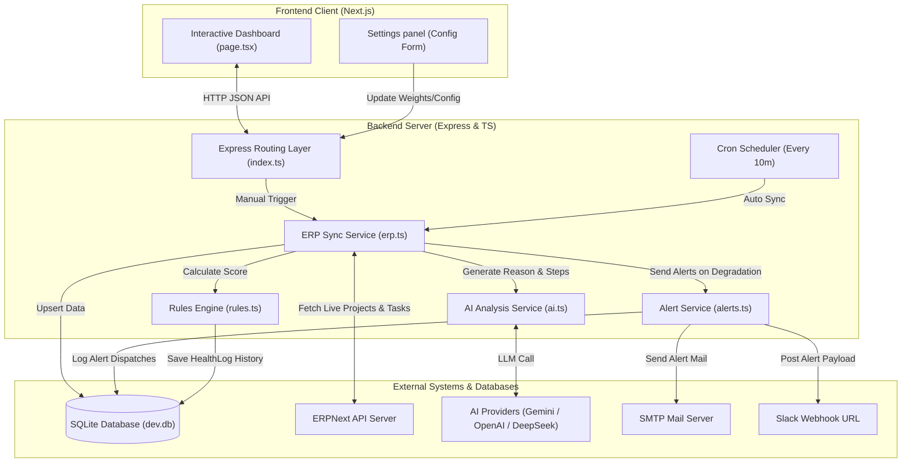
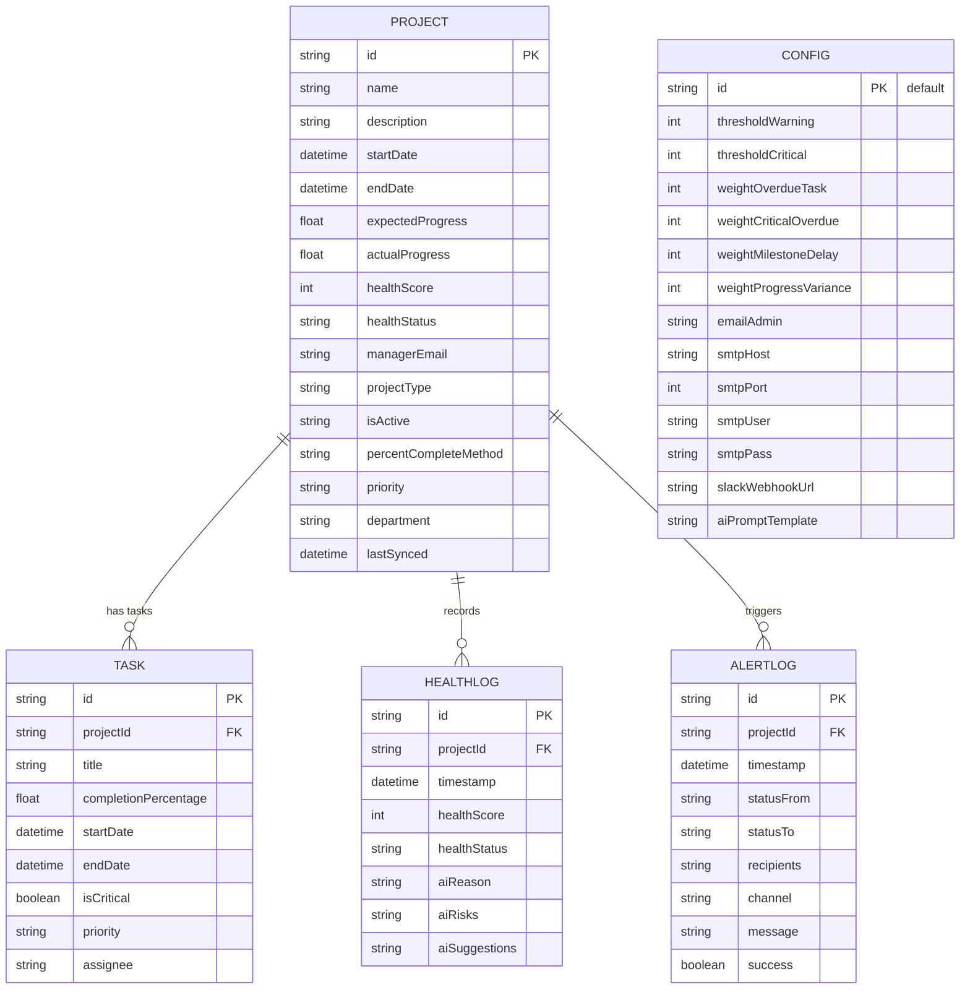

# AI-Powered ERP Project Health Monitoring Platform

Welcome to the **AI-Powered ERP Project Health Monitoring Platform** documentation. This project provides an intelligent, full-stack middleware and dashboard designed to synchronize project schedules and task timelines from ERPNext, evaluate their status using a deterministic health scoring engine, generate AI-driven explanations and recommendations, and dispatch automatic notifications to project managers and administrators.

---

## 🎯 Project Goal & Overview

Managing enterprise-level project portfolios (e.g., ERP deployments) requires active oversight of task dependencies, progress variance, and timeline drift. This platform replaces manual check-ins with an automated flow:
1. **Sync**: Connects via API token auth to a live ERPNext instance (or falls back to a simulated ERP dataset) to fetch projects and tasks.
2. **Assess**: Computes a project-level health score ($0 - 100$) based on deadline deviations, critical tasks, and expected-vs-actual completion percentages.
3. **Analyze**: Hands over project context to an LLM (Gemini, OpenAI, or DeepSeek) to describe specific risks and actionable remediation steps.
4. **Alert**: Sends immediate alert logs and dispatches notifications via Email (SMTP) and Slack Webhooks if status degrades into `WARNING` or `CRITICAL`.
5. **Visualize**: Renders a glassmorphic dashboard built in Next.js showing real-time statistics, detailed Gantt-like task tracking, and sync history.

---

## 🛠️ Technology Stack
The platform is designed as a decoupled full-stack application leveraging the following technology stacks:
### 1. Backend Middleware
* **Runtime**: [Node.js](https://nodejs.org) (v18+) with [TypeScript](https://www.typescriptlang.org/) executed locally via `ts-node-dev`.
* **Framework**: [Express.js](https://expressjs.com/) for building fast, lightweight REST APIs.
* **Database & ORM**: [Prisma ORM](https://www.prisma.io/) with a local file-based [SQLite](https://www.sqlite.org/) database (`dev.db`).
* **AI Client Libraries**:
  * `@google/genai` (Google GenAI SDK) for integrating the **Gemini 2.5 Flash** model.
  * `openai` SDK for routing calls to **GPT-4o** and **DeepSeek-Chat** APIs.
* **Notification Clients**:
  * [Nodemailer](https://nodemailer.com/) for SMTP email generation and transmission.
  * Web Fetch API for Slack Webhook payload dispatches.
* **Automation**: `node-cron` for running automated ERP synchronization cycles (every 10 minutes).
### 2. Frontend Dashboard
* **Framework**: [Next.js](https://nextjs.org/) (v16) leveraging the modern **App Router** conventions.
* **UI Components**: [React](https://react.dev/) (v19) client-rendered dashboard states and sliders.
* **Styling & Assets**: Vanilla CSS (`globals.css`) with standard CSS variables, modern dark themes, glassmorphism panel styles, and inline custom SVGs.
---

## 🏛️ System Architecture

The project is structured as a decoupled **Client-Server Architecture** with a background scheduler:



---

## 📂 Project Directory Structure

```text
AI-Powered Project Health Monitoring/
├── package.json                   # Root package runner (concurrently runner)
├── README.md                      # Quick start guide
├── backend/                       # Express Node.js & TypeScript Server
│   ├── prisma/
│   │   ├── dev.db                 # SQLite database storage file
│   │   └── schema.prisma          # Prisma schema declaration
│   ├── src/
│   │   ├── db.ts                  # Exports Prisma client instance
│   │   ├── index.ts               # Server entry point, API routes, Cron scheduling
│   │   ├── engine/
│   │   │   └── rules.ts           # Project health scoring calculations
│   │   └── services/
│   │       ├── ai.ts              # AI model APIs (Gemini, OpenAI, DeepSeek)
│   │       ├── alerts.ts          # Email & Slack notification dispatch handlers
│   │       └── erp.ts             # ERPNext synchronization engine & Mock data
│   ├── .env                       # Backend local configuration & API credentials
│   ├── tsconfig.json              # TypeScript compilation rules
│   └── package.json               # Backend dependencies & script definitions
└── frontend/                      # Next.js React Dashboard UI
    ├── public/                    # Static UI elements & icons
    ├── src/
    │   └── app/
    │       ├── favicon.ico
    │       ├── globals.css        # Glassmorphism styling rules & UI tokens
    │       ├── layout.tsx         # Page wrapper & metadata
    │       └── page.tsx           # Single-page dynamic control dashboard
    ├── next.config.ts             # Next.js configurations
    ├── tsconfig.json              # Frontend TypeScript configs
    └── package.json               # Frontend dependencies & React scripts
```

---

## 🗄️ Database Schema & Models

The database is built on **SQLite** using **Prisma ORM**. The data model relations are shown below:



### Table Fields Summary

1. **`Project`**: Core project entities. Track expected progress (timeline-based) vs. actual progress (task-average) alongside computed health attributes.
2. **`Task`**: Individual items belonging to a project. Specifies if a task is on the **Critical Path** (`isCritical: true`) and logs individual completions.
3. **`HealthLog`**: History tracker of project scores and statuses over time, saving AI analysis outputs (`aiReason`, `aiRisks`, and `aiSuggestions`) to display status charts.
4. **`AlertLog`**: Audits and traces notification dispatches, noting whether Email/Slack requests succeeded or failed.
5. **`Config`**: Global threshold configurations, penalty weights for the health engine, SMTP server parameters, Slack hook details, and AI prompt templates.

---

## 🧮 Project Health Scoring Engine

The scoring engine is defined in [rules.ts](file:///d:/E%20drive/All%20Projects/AI-Powered%20Project%20Health%20Monitoring/backend/src/engine/rules.ts). It starts with a base score of **100** and applies negative adjustments according to settings:

### 1. Progress Calculation
- **Expected Progress (%)**: Calculated linearly based on elapsed calendar time relative to the project duration:
  $$\text{Expected Progress} = \frac{\text{Current Date} - \text{Start Date}}{\text{End Date} - \text{Start Date}} \times 100$$
  *(Capped between 0% and 100%)*
- **Actual Progress (%)**: Calculated as the average completion percentage of all tasks belonging to the project:
  $$\text{Actual Progress} = \frac{\sum \text{Task Completion Percentage}}{\text{Number of Tasks}}$$
  *(If a project contains 0 tasks, it falls back to using the `percent_complete` attribute synced directly from ERPNext)*

### 2. Applied Deductions (Weights are Configurable)
- **Overdue Task**: Deducts `weightOverdueTask` (Default: **-5 pts**) for each task that is overdue by $> 3$ days (incomplete and current date is past the task's end date).
- **Critical Overdue Task**: Deducts `weightCriticalOverdue` (Default: **-10 pts**) for any overdue task marked as critical (i.e. high-priority milestone/critical path).
- **Milestone Delay**: Deducts `weightMilestoneDelay` (Default: **-15 pts**) if the current date is past the overall project end date and the project is still incomplete.
- **Progress Variance**: Deducts `weightProgressVariance` (Default: **-20 pts**) if the actual progress falls behind the expected progress by more than **20%**.

### 3. Status Mapping
The final computed health score is mapped to one of three health statuses:
- **`HEALTHY`**: Score is $\ge$ `thresholdWarning` (Default: **80**).
- **`WARNING`**: Score is $<$ `thresholdWarning` but $\ge$ `thresholdCritical` (Default: **60**).
- **`CRITICAL`**: Score is $<$ `thresholdCritical` (Default: **60**).

---

## 🤖 AI Insight Service

The AI analyzer in [ai.ts](file:///d:/E%20drive/All%20Projects/AI-Powered%20Project%20Health%20Monitoring/backend/src/services/ai.ts) takes project parameters (metadata, task list, timeline, and list of deduction penalties) and evaluates them using a customizable prompt template.

### Supported Providers & Models
The platform checks the backend `AI_PROVIDER` environment variable to choose a provider:
- **Gemini**: Utilizes the Google GenAI SDK (`@google/genai`) invoking model **`gemini-2.5-flash`** with structured JSON output enforcement.
- **OpenAI**: Utilizes the standard OpenAI SDK (`openai`) calling model **`gpt-4o`** with JSON response formatting.
- **DeepSeek**: Connects to the DeepSeek API through the OpenAI client config calling model **`deepseek-chat`**.
- **Mock Fallback**: If no API key is specified for the selected provider, a local fallback function `getMockAIAnalysis()` immediately generates structured dummy project summaries to let the application run out-of-the-box.

### Prompt Template structure
The default prompt template stored in the database configuration looks like:
```text
Analyze the project health for '{{projectName}}'. Health Score: {{healthScore}}, Status: {{healthStatus}}. Tasks: {{tasksSummary}}.
Provide:
1. Reason for status
2. Key risks
3. Corrective recommendations.
```
This is passed alongside metadata (department, completion methods, etc.) and deduction reasons, returning a structured JSON response:
```json
{
  "reason": "The project is At Risk due to critical task 'Cluster Migration' being overdue.",
  "risks": ["Potential milestone slippage", "SLA violation"],
  "suggestions": ["Reallocate development team resources to Sarah Chen", "Renegotiate due date"]
}
```

---

## 🔔 Alerts & Notification Channels

The alerting system in [alerts.ts](file:///d:/E%20drive/All%20Projects/AI-Powered%20Project%20Health%20Monitoring/backend/src/services/alerts.ts) triggers notifications when:
1. A project status transitions from non-critical (Healthy or Warning) to **`CRITICAL`**.
2. A project status transitions to **`WARNING`** (lower severity alert).

### Alert Dispatch Mechanisms:
1. **Email Alerts (SMTP)**:
   - Configured dynamically via UI Settings (host, port, user, pass).
   - Uses `nodemailer` to dispatch HTML emails containing the previous status, current status, computed score, AI reasoning, and recommended action bullet-points.
   - Dispatches to the specific project manager's email (synced from ERPNext) and the main administrator email (`emailAdmin`).
   - If SMTP credentials are not filled, it falls back to a simulated terminal output warning representation.
2. **Slack Alerts (Webhook)**:
   - If a `slackWebhookUrl` is configured in Settings, the middleware posts a rich text payload summarizing the project alert, AI analysis, and action plans.
3. **Audit Log**:
   - Each dispatch is saved in the local database `AlertLog` table to monitor successful deliveries and errors.

---

## 🌐 API Middleware Endpoints

The Express backend exposes the following routes for client interaction:

| HTTP Method | Route | Description | Auth Required |
| :--- | :--- | :--- | :--- |
| **GET** | `/api/projects` | Retrieves list of all projects and task summaries. | No |
| **GET** | `/api/projects/:id` | Detailed project info, including task timelines, health logs, and alert logs. | No |
| **POST** | `/api/sync` | Manually triggers the ERPNext synchronization and health score recalculation. | No |
| **GET** | `/api/config` | Retrieves the current health weights and alert credentials configuration. | No |
| **PUT** | `/api/config` | Updates system configurations and trigger automated recalculations. | No |
| **GET** | `/api/mock-erp/projects` | Endpoint providing mock ERPNext response datasets for offline testing. | Yes (`x-api-key`) |

---

## 🖥️ Next.js Frontend Dashboard

The frontend is a single-page reactive dashboard with a modern dark-mode aesthetic featuring:
- **Metrics Overview Bar**: Displays portfolio health statistics (Overall index, Healthy counts, Warn counts, Critical counts) with progress indicators.
- **Projects Grid**: Each card displays project details, EXPECTED vs. ACTUAL timeline mismatch progress, metadata badges, and current health score.
- **AI Insights Slide-Out / Modal**: Renders detailed timelines, identifies critical path delays, shows AI analysis reasonings, bulleted risks, and recommendations.
- **Configuration Panel (Settings Tab)**: Allows administrators to adjust margins, penalties, SMTP keys, Slack webhooks, and AI prompt variables.
- **Sync Logs Visualizer**: Displays immediate text outputs returned during synchronization actions for debug purposes.

---

## ⚙️ Environment Variables Config

Configure variables in `backend/.env`:

```env
PORT=5000                              # Port backend runs on
DATABASE_URL="file:./dev.db"           # SQLite filepath
AI_PROVIDER="gemini"                   # 'gemini' | 'openai' | 'deepseek'
GEMINI_API_KEY="AIzaSy..."             # Gemini API key (optional)
OPENAI_API_KEY="sk-..."                 # OpenAI API key (optional)
DEEPSEEK_API_KEY="sk-..."               # DeepSeek API key (optional)
ERPNEXT_API_KEY="d296ff153c0517bdcsds"      # ERPNext API Token Key (optional)
ERPNEXT_API_SECRET="59a2b3e39ff8ebdewdcdzdd"   # ERPNext API Token Secret (optional)
ERPNEXT_BASE_URL="https://..."         # ERPNext Base instance URL
ERP_API_KEY="supersecret_api_key"      # API Key protection for internal endpoints
```

---

## 🚀 Setup & Execution Guide

### Prerequisites
- Node.js (v18+)
- npm

### 1. Install Dependencies
In the root directory, run:
```bash
npm install
npm run install:all
```
This installs the root dev runner `concurrently`, then installs local packages inside `backend/` and `frontend/` folders.

### 2. Initialize Database
Create and push the schema to SQLite local database file:
```bash
cd backend
npx prisma db push
cd ..
```

### 3. Run Dev Mode
Run the concurrent dev command in the root folder:
```bash
npm run dev
```
- **Express Backend** will launch on `http://localhost:5000`
- **Next.js Frontend** will launch on `http://localhost:3001` (or `http://localhost:3000`)
- An initial ERP synchronization will trigger immediately on server boot.

---

*Document compiled dynamically. Updated: June 2026.*
